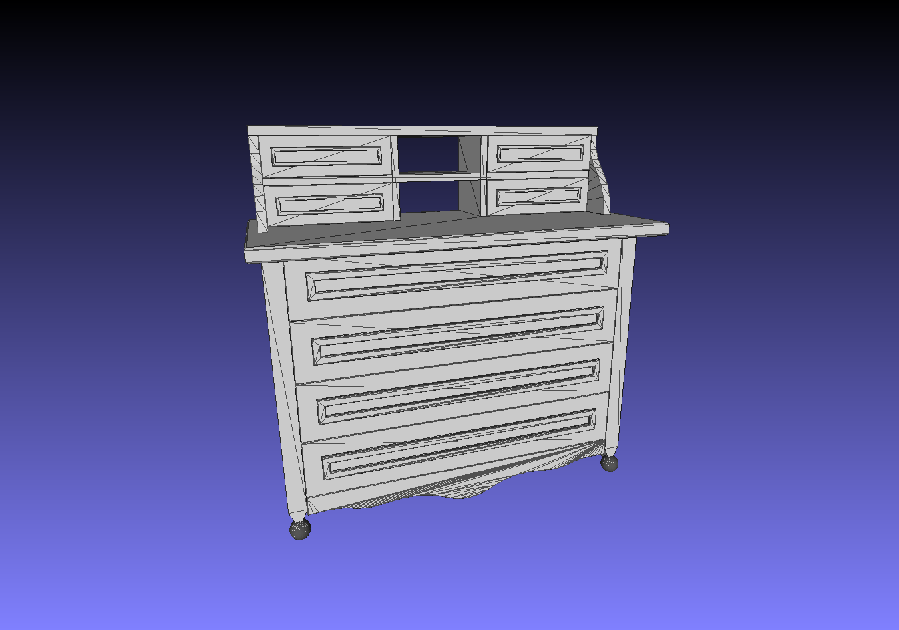
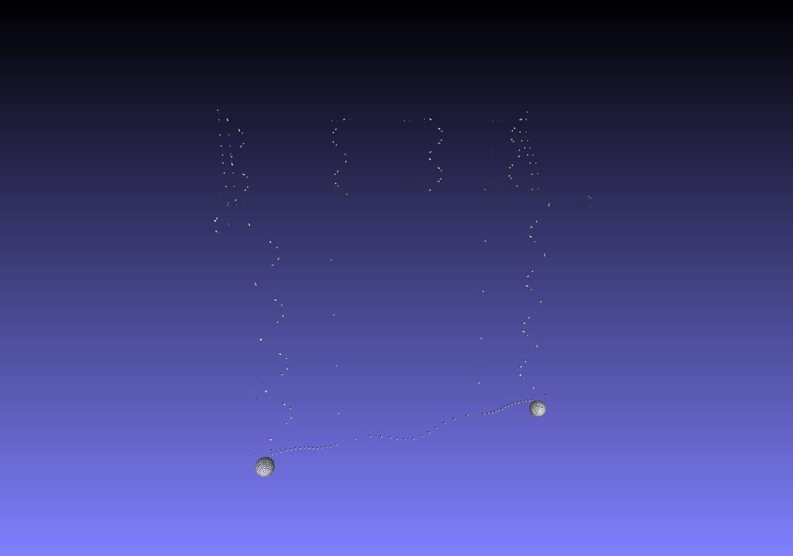
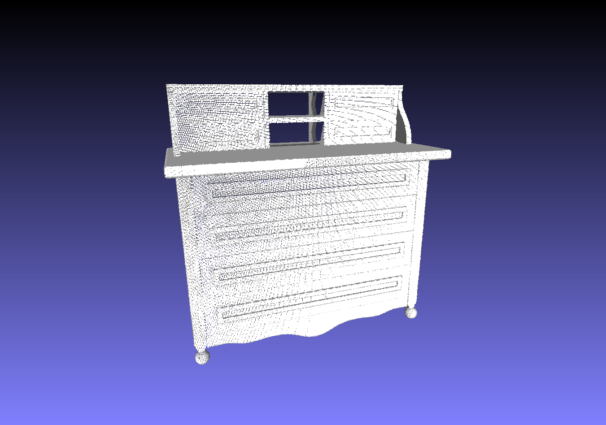

# Convert 3D mesh model to Point Cloud

The code is based on the [CGAL](http://www.cgal.org/) and the [Eigen](http://eigen.tuxfamily.org/index.php?title=Main_Page) library.

It is used to convert the 3D models (.obj, .off) to dense point clouds with normals. 


# Usage

```
mkdir build && cd build
cmake ..
make -j4
./convert <file_name>
```


